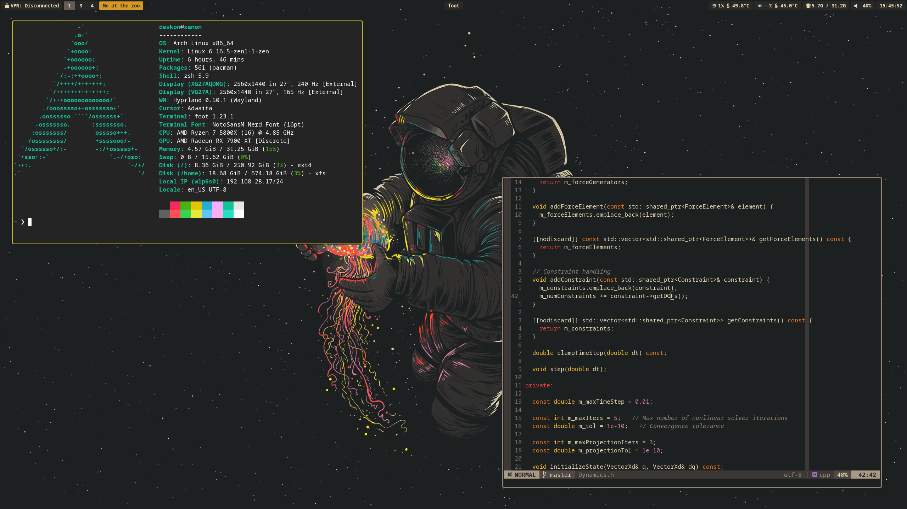

# dotfiles

A unified collection of configuration files for my development environment, organized by tool and deployed with [GNU Stow](https://www.gnu.org/software/stow/).

---

##  Repository Structure
assets/ – Misc graphics, icons, or imagery.
hypr/ – Hyprland config files.
kitty/ – Kitty terminal configuration.
nvim/ – Neovim setup (Lua).
rofi/ – Rofi theme and launcher config.
waybar/ – Waybar panel setup.
zsh/ – Zsh shell configuration.
stow.sh – Helper script for deploying configs.
README.md – You're reading it.

---

##  Installation

Clone and deploy in one command:

```bash
git clone https://github.com/devk0n/dotfiles.git ~/dotfiles
cd ~/dotfiles
./stow.sh
```

The included stow.sh script symlinks each folder into your ~/.config directory. You can also run it again to restow any updates.

---

## Visual Preview




